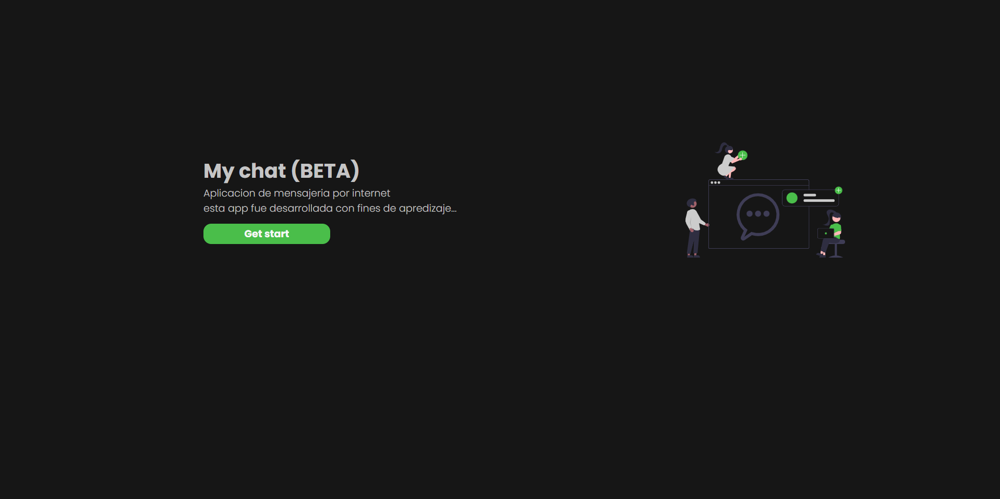
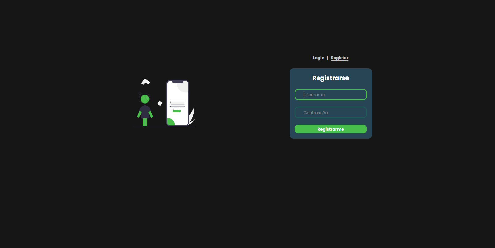
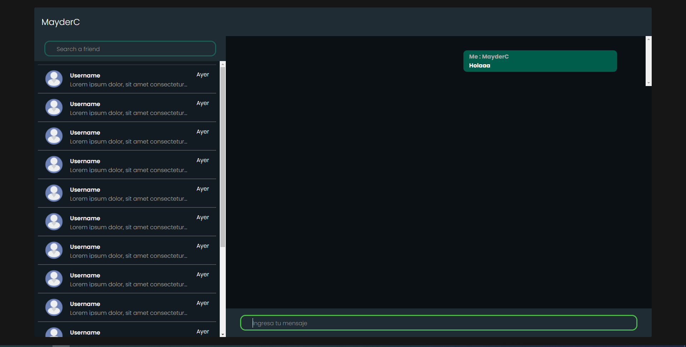

#Mychat

### App Mychat: chat en tiempo real con una sala global para todos los usuarios registrados.

#### Tecnologías usadas

- Reactjs
- Socket io
- Scss, Sass

link: https://frosty-mayer-9c261d.netlify.app/
La applicacion es muy lenta debido a los servidores, que son gratuitos para proyectos personales.

Página principal

Página de autenticacion

Página de chats

## Scripts

### `npm start`

Runs the app in the development mode.\

### `npm test`

Launches the test runner in the interactive watch mode.\

### `npm run build`

Builds the app for production
